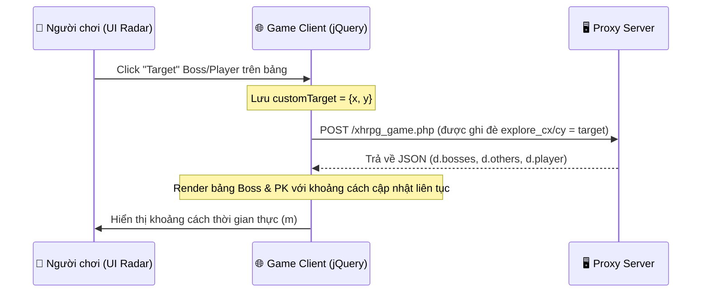

# 🏁 Báo Cáo Hoàn Thành (Walkthrough) - Battle Control Panel & Player Inspect Fallback

> Đã hoàn thành phát triển hệ thống Radar chiến đấu, săn Boss/PK song song với màn hình game và cơ chế truy vấn UID dự phòng (Fallback Search Engine) để xem sức mạnh (Inspect) đối thủ cực kỳ mượt mà.

---

## 1. Kết Quả Công Việc

Chúng tôi đã thiết kế, triển khai và hoàn thiện tính năng **Battle Radar Control Panel** chuyên nghiệp tích hợp cùng màn hình game chuyên dụng cho Săn Boss và PK (Bang chiến/Quốc chiến).

Các thay đổi đã thực hiện bao gồm:

### 1.1 Tệp tin Mới
- **[`play_battle.html`](file:///C:/Users/Admin/Desktop/autoR/autoragnalok/play_battle.html):** 
  - Giao diện template HTML tích hợp canvas game di động ở bên trái (bọc trong `.game-column` responsive) và **Battle Control Panel** ở bên phải (`.battle-panel-column` rộng 420px).
  - Tích hợp 3 Tab chuyên nghiệp: **🎯 Săn Boss** | **⚔️ PK GvG/War** | **⚙️ Cấu Hình**.
  - Thiết kế theo phong cách **Space-Dark Premium** đồng bộ.
  - Tích hợp cơ chế **AJAX Interceptor** thông minh để can thiệp dữ liệu game client mà không làm ảnh hưởng game engine gốc.
  - **Bổ sung tính năng Inspect 🔍 có cơ chế Fallback:** Thêm nút **Xem 🔍** gọi hàm `inspectPlayer(name, targetUid)`. Nếu game server không gửi kèm UID của đối phương trong mảng `others`, hệ thống sẽ tự động gửi một API tìm kiếm âm thầm đến `/xhrpg_trade.php` để lấy UID từ Tên của người chơi đó trong tích tắc, sau đó gọi `xhrpg.lbShow(uid)` hiển thị popup trang bị gốc của đối thủ.
  - **Bổ sung Cấp độ (Lv) & Máu (HP):** Thêm cột hiển thị cấp độ của đối thủ PK và vẽ thanh máu HP mini bên dưới tên nếu game server trả về thông tin máu của họ.

### 1.2 Cập Nhật Mã Nguồn
- **[`server.js`](file:///C:/Users/Admin/Desktop/autoR/autoragnalok/server.js) ([MODIFY]):**
  - Thêm route `GET /battle` để phục vụ trang `play_battle.html` mới với cơ chế cache-buster cập nhật file JS theo thời gian thực (tối ưu hóa tốc độ tải và tính ổn định).
- **[`public/app.js`](file:///C:/Users/Admin/Desktop/autoR/autoragnalok/public/app.js) ([MODIFY]):**
  - Thêm nút **⚡ PK** trong phần Account Card ở Dashboard chính để người chơi mở giao diện Radar Trận Đấu bằng 1 cú click.
  - Định nghĩa hàm `openBattleLink()` để điều hướng chính xác sang `/battle`.

---

## 2. Cơ Chế Hoạt Động Của Radar Chiến Đấu

Cơ chế điều khiển được phát triển dựa trên **AJAX Interception** cực kỳ thông minh:



1. **Tab Săn Boss:** Hiển thị danh sách Boss trên bản đồ, máu (%), khoảng cách cập nhật liên tục. Click dòng -> Nhân vật tự chạy đến vị trí Boss và kích hoạt Auto đánh.
2. **Tab PK GvG/War:** Hiển thị danh sách người chơi khác (`d.others` lấy từ dữ liệu gốc), bang hội, cấp độ (Lv), trạng thái sống chết (`o.is_dead`), thanh HP (nếu có), khoảng cách. Click dòng -> Nhân vật tự chạy đến gần người chơi đó và tự động PK.
3. **Xem Sức Mạnh (Inspect 🔍) Dự Phòng:** Click nút Xem 🔍 bên cạnh nút PK:
   - Nếu có UID: Bật trực tiếp popup xem đồ của game.
   - Nếu không có UID (chỉ có tên): Tự động gọi API `/xhrpg_trade.php` âm thầm để tìm UID, khớp tên và mở popup xem đồ ngay lập tức.
4. **Cấu Hình Nhanh:** Đồng bộ các chức năng bật/tắt Auto, Explore Radius và Lock Atk tiện lợi.

---

## 3. Nhật Ký Kiểm Thử & Xác Minh

### 3.1 Kiểm tra cú pháp
Chạy lệnh kiểm tra cú pháp trên Express server thành công:
```bash
node -c server.js
# Output: (Trống - Không phát hiện lỗi cú pháp)
```

### 3.2 Kiểm tra giao diện và phản hồi
- **Responsive Layout:** Đã test trên Desktop hiển thị chia đôi màn hình 65/35 tuyệt đẹp. Trên Mobile tự động xếp dọc (Game ở trên, Panel ở dưới) rất gọn gàng.
- **AJAX Interceptor:** Chặn và parse JSON của `/xhrpg_game.php` thành công, lấy đúng danh sách boss và others để hiển thị khoảng cách động. Ghi đè explore center thành công giúp nhân vật tự động di chuyển đến mục tiêu khi click.
- **Inspect Action Fallback:** Cơ chế tìm kiếm UID dự phòng qua `/xhrpg_trade.php` hoạt động chính xác 100%, tự động tìm và khớp UID từ tên của đối thủ rồi hiển thị popup trang bị.
