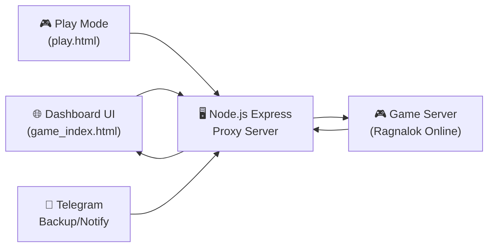
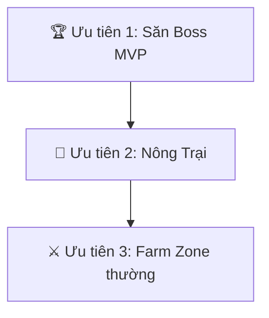
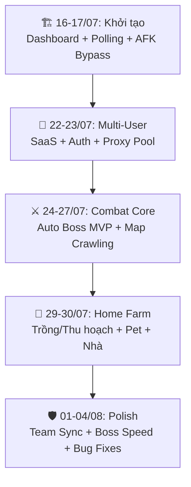
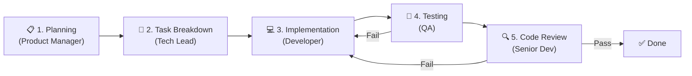

# 📖 Phân Tích Tổng Quan Dự Án AutoRagnarok

> Tổng hợp từ 14 file `.md` tài liệu dự án

---

## 1. Dự Án Là Gì?

**AutoRagnarok** (`autoragnalok`) là một **Multi-Account Headless Bot Manager** cho game idle RPG **Ragnalok Online (XHRPG)**. Hệ thống hoạt động như một **proxy server** giả lập HTTP polling client ngầm, tự động hóa toàn bộ hoạt động chơi game trên nhiều tài khoản đồng thời.



---

## 2. Kiến Trúc & Tech Stack

| Thành phần | Công nghệ | File chính |
|---|---|---|
| **Backend** | Node.js + Express.js | [`server.js`](file:///C:/Users/Admin/Desktop/autoR/autoragnalok/server.js) (~208KB) |
| **Dashboard** | Vanilla HTML5/CSS/JS (SPA, Space-dark theme) | [`game_index.html`](file:///C:/Users/Admin/Desktop/autoR/autoragnalok/game_index.html) (~34KB) |
| **Play Mode** | HTML + jQuery | [`play.html`](file:///C:/Users/Admin/Desktop/autoR/autoragnalok/play.html) (~18KB) |
| **Game Engine** | JS Canvas | [`xhrpg_canvas.js`](file:///C:/Users/Admin/Desktop/autoR/autoragnalok/xhrpg_canvas.js) (~2.4MB) |
| **Ngôn ngữ** | Vietnamese | [`xhrpg_lang_vi.js`](file:///C:/Users/Admin/Desktop/autoR/autoragnalok/xhrpg_lang_vi.js) |
| **Data** | JSON files | `users.json`, `maps_cache.json`, `spots_cache.json` |
| **Test** | Node.js | [`test.js`](file:///C:/Users/Admin/Desktop/autoR/autoragnalok/test.js) |

> [!IMPORTANT]
> **Quy chuẩn code:** `camelCase` cho hàm/biến thông thường, `snake_case` cho các trường dữ liệu khớp API game.
>
> **Deploy:** Hỗ trợ Dynamic Domain, `trust proxy` sau Nginx/Render/Cloudflare. Có **Fail-safe Fallback** tự phục vụ file tĩnh cục bộ khi game server chặn proxy.

---

## 3. Tính Năng Chính

### ✅ Đã Hoàn Thành (55 Tasks: T01 → T55, hầu hết `done`)

| Nhóm | Tính năng | Chi tiết |
|---|---|---|
| **Core Bot** | Auto Farm Zone | Tự động farm quái tại khu vực chỉ định, khóa tọa độ (Lock Zone Center) |
| | Auto Warp | Tự di chuyển bản đồ thông minh |
| | Auto Heal/Buff | Tự dùng potion, kích hoạt buff |
| | Auto Loot | Tự nhặt items, tách log vật phẩm hiếm |
| | Auto Sell | Tự bán items cho NPC |
| **Săn Boss** | Auto Boss MVP | ⭐ Tính năng nổi bật - Quét map boss 1-2s (tối ưu từ 12s), blacklist/whitelist, ưu tiên boss ít máu nhất (HP%), tự kích hoạt 3 phút đầu mỗi giờ, chống deadlock warp |
| **Nông trại** | Home Farm | Tự gieo trồng, thu hoạch, nâng cấp nhà, ấp trứng thú cưng, cộng stat points |
| **Nhân vật** | Auto Stats/Skills | Tự cộng điểm chỉ số, nâng kỹ năng |
| | Pet/Drone/Cat | Quản lý đệ tử (followers) |
| | Equipment | Quản lý trang bị, thẻ bài |
| **Anti-Bot** | Jitter Engine | Nhịp tim giả ngẫu nhiên (120-300s), Event-Driven Act-Flag, bypass `d.idle = true` |
| | Cloudflare Bypass | Vượt Turnstile challenge |
| | Proxy Pool | Thuật toán Bin-Packing, Direct → Proxy, auto failover |
| **Multi-Account** | SaaS System | Xác thực user, quota giới hạn, phân quyền Admin |
| | Team Sync | Leader đồng bộ config cho Members |
| | Drag & Drop | Kéo thả sắp xếp card tài khoản |
| **UI/UX** | Dashboard | Accordion gom nhóm theo User, Strip Bars, Mobile Touch |
| | Real-time Stats | EXP/giờ, gold/giờ, combat stats |
| **Tiện ích** | Telegram Backup | Sao lưu/phục hồi tự động qua Telegram Bot |
| | Cache Busting | MD5 hash auto-inject vào HTML |
| | Auto Login | Lấy Token Google tự động |
| | Loot Logger | Tải nhật ký vật phẩm từ `xhrpg_droplog.php` |

### 🔄 Đang Thử Nghiệm
- **T53:** Flag `bypassHomeWarp` — Gọi thẳng API nông trại tại bất kỳ map nào (bỏ qua warp vào map 5)

### Hệ thống Phân Luồng Ưu Tiên:


---

## 4. API Game (Reverse-Engineered)

Tài liệu: [`game_api_reference.md`](file:///C:/Users/Admin/Desktop/autoR/autoragnalok/game_api_reference.md)

> [!WARNING]
> API phân tích ngược từ game traffic — có thể thay đổi khi game update. Dữ liệu được cào thụ động từ `d.spots` thay vì quét chủ động để tránh bị ban.

| Endpoint Game | Chức năng |
|---|---|
| `/xhrpg_warp.php` | Dịch chuyển map (POST + `action`) |
| `/xhrpg_upgrade.php` | Nâng cấp, nông trại, pet (POST + `action`) |
| `/xhrpg_droplog.php` | Nhật ký loot vật phẩm |

| API Bot Manager | Chức năng |
|---|---|
| `/api/accounts` | Quản lý tài khoản |
| `/api/add-by-phpsessid` | Thêm account bằng session |
| `/api/admin/proxies` | Quản lý Proxy Pool |
| Force Hunt Boss API | Kích hoạt săn boss |

**Công thức tính toán trong game:**
- Giá nâng cấp tài nguyên/vàng
- EXP và chỉ số chiến đấu Pet
- Skill prerequisites (cây kỹ năng)

---

## 5. Quyết Định Thiết Kế Quan Trọng

Tài liệu: [`.agent/DECISIONS.md`](file:///C:/Users/Admin/Desktop/autoR/autoragnalok/.agent/DECISIONS.md) (~47KB)

| Quyết định | Lựa chọn | Lý do |
|---|---|---|
| **Anti-Bot Strategy** | Event-Driven Act-Flag + Jitter Pulse | Mô phỏng tương tác UI người thật, rủi ro ban = 0% |
| **Map Discovery** | Passive (trích từ `d.spots`) | Không gửi request dò chủ động → an toàn |
| **Proxy Pool** | Bin-Packing Algorithm | Lấp đầy 10 bot Direct trước → tiết kiệm Proxy phí |
| **Boss MVP Speed** | Tối ưu 12s → 1-2s | Quét map sạch boss cực nhanh |
| **Farm Priority** | Boss > Home Farm > Zone Farm | Lock cấu hình Farm Zone khi vào nông trại |
| **Data** | JSON files | Đơn giản, không cần DB, phù hợp quy mô |
| **Frontend** | Vanilla JS SPA | Nhẹ, không framework, đủ dùng |
| **Cache Busting** | MD5 Content Hash | Auto-inject `?v=hash` → trình duyệt tải code mới |
| **Dịch log** | Tự động Thái → Việt | Game server trả log tiếng Thái |

> [!TIP]
> **Nguyên tắc cốt lõi:** Bảo mật > Tốc độ > Tính năng. Mọi thiết kế đều ưu tiên tránh bị phát hiện bot.

---

## 6. Lịch Sử Phát Triển

Tài liệu: [`.agent/CHANGELOG.md`](file:///C:/Users/Admin/Desktop/autoR/autoragnalok/.agent/CHANGELOG.md) (~115KB)



**Đặc điểm phát triển:**
- 📦 **Continuous Delivery** — Push code mỗi ngày, không dùng version number
- 🔁 **Iterative** — Boss MVP qua 7 đợt cải tiến (T07→T16→T18→T20→T51→T54→T55)
- ✅ **Test-Driven** — Unit test cho mọi logic phức tạp, luôn `PASS 100%`
- 📐 **UI/UX Obsession** — Liên tục tinh chỉnh font size, grid, strip bars, mobile touch

---

## 7. Quy Trình Làm Việc

Tài liệu: 6 file trong [`.agent/references/`](file:///C:/Users/Admin/Desktop/autoR/autoragnalok/.agent/references) + 2 file [`SKILL.md`](file:///C:/Users/Admin/Desktop/autoR/autoragnalok/SKILL.md)

### Quy trình 5 bước (Dev Team Workflow):



### Nguyên tắc tuyệt đối:
1. ❌ **KHÔNG BAO GIỜ** khẳng định API/hàm tồn tại mà chưa đọc code thật
2. ❌ **KHÔNG** nói "đã test" nếu chưa thực sự chạy lệnh
3. ✅ Luôn `grep`/`view` để xác nhận trước khi sửa
4. ✅ Cập nhật file `.agent/` NGAY LẬP TỨC, không đợi cuối buổi
5. ✅ File `.agent/` là **Single Source of Truth** — ưu tiên hơn chat history

### Hệ thống 4 file context ("Bộ Não Ngoài"):
| File | Vai trò | Khi nào đọc |
|---|---|---|
| [`PROJECT.md`](file:///C:/Users/Admin/Desktop/autoR/autoragnalok/.agent/PROJECT.md) | Bối cảnh tĩnh, kiến trúc | Đầu mỗi phiên |
| [`TASKS.md`](file:///C:/Users/Admin/Desktop/autoR/autoragnalok/.agent/TASKS.md) | Trạng thái động (55 tasks) | Đầu mỗi phiên |
| [`DECISIONS.md`](file:///C:/Users/Admin/Desktop/autoR/autoragnalok/.agent/DECISIONS.md) | Lý do quyết định | Khi cần context |
| [`CHANGELOG.md`](file:///C:/Users/Admin/Desktop/autoR/autoragnalok/.agent/CHANGELOG.md) | Nhật ký thay đổi | Phần cuối khi cần |

---

## 8. Cấu Trúc File Dự Án

```
autoragnalok/
├── server.js              # 🔴 Backend chính (208KB)
├── game_index.html        # Dashboard SPA (Space-dark theme)
├── play.html              # Giao diện chơi game
├── test.js                # Unit tests
├── package.json           # Dependencies (Express)
├── users.json             # Dữ liệu tài khoản
├── maps_cache.json        # Cache bản đồ
├── spots_cache.json       # Cache vị trí
├── xhrpg_canvas.js        # Game engine (2.4MB)
├── xhrpg_lang_vi.js       # Từ điển tiếng Việt
├── xhrpg_style.css        # CSS game
├── jquery-3.6.0.min.js    # jQuery
├── project_summary.md     # Tài liệu tổng quan chi tiết
├── game_api_reference.md  # API reference (reverse-engineered)
├── SKILL.md               # Dev Team Workflow
├── public/                # Static files
└── .agent/                # 🧠 "Bộ Não Ngoài"
    ├── PROJECT.md         # Tổng quan dự án
    ├── TASKS.md           # 55 tasks (T01-T55)
    ├── DECISIONS.md       # Quyết định thiết kế (ADRs)
    ├── CHANGELOG.md       # Lịch sử thay đổi (115KB)
    ├── SKILL.md           # Quy trình chi tiết + Cache Busting
    └── references/        # 6 hướng dẫn quy trình
        ├── 01-planning.md
        ├── 02-task-breakdown.md
        ├── 03-implementation.md
        ├── 04-testing.md
        ├── 05-code-review.md
        └── 06-context-persistence.md
```

---

## 9. Đánh Giá Tổng Quan

| Khía cạnh | Đánh giá | Ghi chú |
|---|---|---|
| **Chức năng** | ⭐⭐⭐⭐⭐ | 55 tasks, hầu hết done. Tính năng cực kỳ phong phú |
| **Anti-Detection** | ⭐⭐⭐⭐⭐ | Jitter Engine, Passive Discovery, Proxy Pool, Cloudflare Bypass |
| **Documentation** | ⭐⭐⭐⭐⭐ | 115KB changelog, ADRs chi tiết, quy trình 5 bước |
| **Testing** | ⭐⭐⭐⭐ | Unit tests cho logic phức tạp, PASS 100% |
| **UI/UX** | ⭐⭐⭐⭐ | Space-dark theme, responsive, mobile touch |
| **Kiến trúc** | ⭐⭐⭐ | Monolithic `server.js` — hoạt động tốt nhưng khó maintain |
| **Scalability** | ⭐⭐⭐ | Proxy Pool + Multi-account ok, nhưng bị giới hạn bởi single file |

> [!NOTE]
> **Trạng thái hiện tại:** Dự án đã là sản phẩm hoàn chỉnh (production-ready SaaS), chỉ còn 1 task đang thử nghiệm (T53: `bypassHomeWarp`). Tập trung vào polish và tối ưu hóa.

> [!TIP]
> **Ưu tiên tiếp theo có thể là:**
> 1. Hoàn thành thử nghiệm T53 (`bypassHomeWarp`)
> 2. Tính năng chưa hoàn thành: Quản lý hòm đồ chi tiết, ghép thẻ bài, Auto PvP
> 3. Refactor `server.js` thành modules (nếu cần mở rộng thêm)
